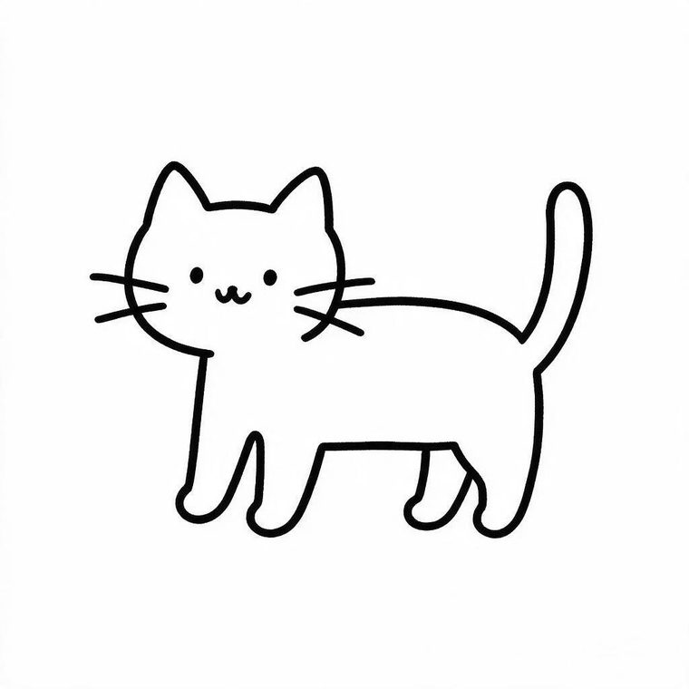
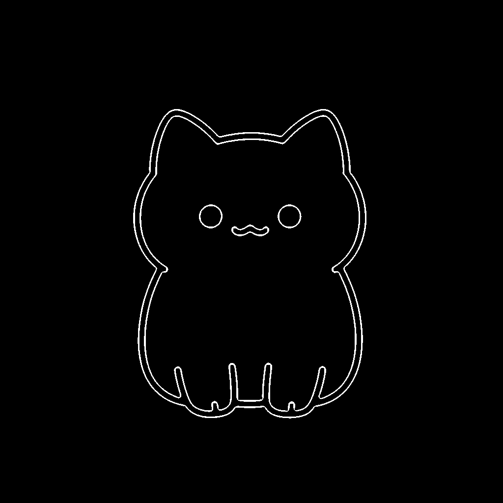

# SimpleDrawBot · 简易画图助手

> **输入一句话，AI 生成简笔画，手机自动替你画出来。**

一个独立开发完成的 Android 应用。把「文字 → AI 图像 → 轮廓 → 笔画坐标 → 自动绘制」整条链路跑通，核心难点不在调用 AI 接口，而在于**让机器画出的线像人画的**。

<p align="left">
  
  
  
  
  
</p>

---

## 目录

- [项目简介](#项目简介)
- [效果展示](#效果展示)
- [完整技术链路](#完整技术链路)
- [核心技术难点](#核心技术难点)
- [版本演进史](#版本演进史)
- [项目结构](#项目结构)
- [快速开始](#快速开始)
- [API Key 配置](#api-key-配置)
- [权限说明与合规声明](#权限说明与合规声明)
- [开发与调试文档](#开发与调试文档)
- [许可](#许可)

---

## 项目简介

SimpleDrawBot 解决的问题很具体：**当你想在某个 App 的涂鸦板、白板或画布上画一幅简笔画，但你不会画。**

使用流程只有三步：

1. 在输入框里打一句话，比如「小猫」
2. 等待几秒，AI 生成一张简笔画，系统自动提取出笔画
3. 点「开始画」，手机自动在屏幕上把这张画一笔一笔画出来

它不依赖目标 App 的任何接口，而是通过 Android 无障碍能力模拟真实手指触摸，因此**对系统内几乎所有支持手绘的应用都通用**。

### 项目数据

| 指标 | 数值 |
|---|---|
| 开发方式 | 个人独立开发 |
| Kotlin 源码 | 14 个模块 / **6,442 行** / 279 KB |
| 迭代版本 | v1.1 → **v3.1**（13 个版本） |
| 单元测试 | 纯 JVM 测试，覆盖自适应粗细、采样间距、伪闭合打断、最窄点查找 |
| 目标平台 | Android 8.0+（minSdk 26 / targetSdk 36） |

---

## 效果展示

完整的交互式作品页在 **[`showcase/`](showcase/)**，直接用浏览器打开 `showcase/index.html` 即可：

- **实时绘制演示** —— 用项目产出的真实笔画坐标 `test_cat_coords.json` 在 Canvas 上逐点还原绘制过程
- **技术链路分解** —— 输入、AI 生成、轮廓提取、笔画转换四阶段可视化
- **Debug 实录** —— 二值化、骨架细化、轮廓提取的中间过程图
- **Prompt 迭代对比** —— v1 到 v6 六轮 Prompt 的真实生成效果对比

| AI 生成 | 轮廓提取 | 骨架细化 |
|---|---|---|
|  |  |  |

---

## 完整技术链路

```
                          ┌─────────────────────────────┐
   用户输入「小猫」  ───▶  │  ①  AI 图像生成              │
                          │  Seedream / SiliconFlow      │
                          │  1024×1024 纯白底简笔画      │
                          └──────────────┬──────────────┘
                                         ▼
                          ┌─────────────────────────────┐
                          │  ②  图像预处理（OpenCV）     │
                          │  灰度 → 二值化 → 开/闭运算   │
                          └──────────────┬──────────────┘
                                         ▼
                          ┌─────────────────────────────┐
                          │  ③  轮廓提取 / 骨架细化      │
                          │  Zhang-Suen 细化 → 单像素中心线 │
                          └──────────────┬──────────────┘
                                         ▼
                          ┌─────────────────────────────┐
                          │  ④  笔画排序                 │
                          │  贪心 TSP，最小化笔画间空移  │
                          └──────────────┬──────────────┘
                                         ▼
                          ┌─────────────────────────────┐
                          │  ⑤  坐标归一化与区域映射     │
                          │  适配用户在屏幕上框选的区域   │
                          └──────────────┬──────────────┘
                                         ▼
                          ┌─────────────────────────────┐
                          │  ⑥  手势注入                 │
                          │  AccessibilityService        │
                          │  .dispatchGesture 逐点绘制   │
                          └──────────────┬──────────────┘
                                         ▼
                              屏幕上出现一幅画 ✨
```

### 三级容错机制

AI 服务不可能永远稳定，所以主链路之外还设计了两条降级路径：

| 层级 | 方案 | 触发条件 |
|---|---|---|
| **一级** | AI 图片生成 + OpenCV 轮廓提取 | 默认路径 |
| **二级** | 结构化绘图指令（文本模型直接输出坐标 JSON） | 图片接口超时 / 下载失败 |
| **三级** | SVG path 解析（`SvgPathParser` 解析 M/L/H/V/C/S 指令） | 前两级均失败 |

---

## 核心技术难点

这是整个项目真正花时间的地方 —— **调用 AI 生成图片只要 20 行代码，让画出来的线不难看花了十几个版本。**

### 难点一：`Paint.getFillPath` 是一个陷阱

**问题**：想让线条变粗，最初的做法是用 `Paint.getFillPath()` 把中心线膨胀成有宽度的路径，再拿去绘制。

**结果**：画出来一团糟 —— 细节消失、线条粘连。

**根因**：`getFillPath()` 返回的是**闭合的双线轮廓**（一条线被膨胀后，外边界形成一个闭合环）。把这个闭合环当笔画路径去画，等于在画「轮廓的轮廓」，自交与重叠导致细节全部糊掉。

> 一句话总结：**膨胀 = 闭合 = 万恶之源。**

**解法**：彻底放弃描边膨胀，全部基于**原始中心线**绘制。

### 难点二：`dispatchGesture` 没有压感

**问题**：想模拟「下笔重 → 线更粗」的效果，尝试放慢绘制速度。

**结论**：行不通。`dispatchGesture` 是模拟触摸事件，**不带压力值**，画得再慢，线宽也只由目标应用自己的画笔决定，和速度无关。

**解法**：v3.1 最终用**同一条中心线叠画 2 遍、横向偏移 1px** 来模拟视觉上的「略粗且饱满」，而不是试图改变笔的粗细。

| 模式 | 核心策略 | 速度 | 效果 |
|---|---|---|---|
| `AUTO` | 中心线叠画 2 遍，横向偏移 1px | 0.6x | 线条略粗、饱满 |
| `PRECISE` | 只画 1 遍中心线 | 1.0x | 最精准，粗细完全交给目标应用 |

### 难点三：「预览很好看，画出来很一般」

**根因分析**：预览是用 `Paint.strokeWidth` 一次性渲染整条路径，线条均匀自然；而实际绘制是把一条线拆成两条边线，再逐点还原 —— **三重误差叠加**：轮廓提取误差 + 采样误差 + 手势注入误差。

**解法**：

- 改用 **Zhang-Suen 骨架细化** 得到单像素宽的中心线，从源头消除「两条边线」问题
- 密集区域**自适应降粗**（避免细节处线条糊成一团）：低密度 100%、中密度 70%、高密度 50%，短笔画额外降粗 30%
- 转角 > 15° 处采样步长从 2px 加密到 1px，消除折线感
- 长笔画自动拆段（> 300px 拆为 2~3 段），减少误差累积
- 全程使用 Float 亚像素坐标，不做整数取整

### 难点四：伪闭合与笔画顺序

- **伪闭合检测**：当首尾距离 < 15px 时，找路径最窄处（< 首尾距离的 30%）打断，恢复成两条独立线条，避免出现多余的闭合圈
- **笔画排序**：用贪心 TSP 规划绘制顺序，最小化笔画之间的空移距离，提升观感连贯度

### 难点五：参数太多，用户不会调

轮廓处理涉及开运算、闭运算、骨架细化三组参数，全部暴露给用户就是灾难。

**解法**：把三路参数统一映射到 UI 上的一个 **「细节程度」滑块**，用户只需拖动一个控件，底层自动联动调整。

---

## 版本演进史

完整记录见 [`docs/devlog/`](docs/devlog/)（每个版本的决策依据、踩坑过程与实测结果）。

| 版本 | 主要变更 |
|---|---|
| **v3.1** | 纯中心线方案 + 叠画模拟粗线；彻底放弃描边膨胀 |
| **v3.0** | 双绘制模式（自动加粗 / 单线精准），绘制质量质变 |
| v2.2 | 两种绘画模式；悬浮球 UI 精简；单元测试 12/12 |
| v2.1 | 修复误区：直接使用中心线，不做预膨胀 |
| v2.0 | 预览级精准加粗；密集区域自适应降粗；伪闭合打断 |
| v1.9 | 双策略描粗（多层叠加 / 慢速渗透）实验 |
| v1.8 | 绘制质量修复：转角改 ROUND 防尖刺，2px 采样 |
| v1.7 | 三路参数映射到单个细节滑块 + 兜底重试 |
| v1.6 | 候选图片选择器（Top-3 搜图结果 + 评分制筛选） |
| v1.5 | 引入 Zhang-Suen 骨架细化算法 |
| v1.4 | 绘制暂停 / 继续 |
| v1.3 | 贪心 TSP 笔画排序 |
| v1.1 | WebView 搜图 + 图片下载与轮廓提取（项目起点） |

---

## 项目结构

```
SimpleDrawBot/
├── app/
│   ├── build.gradle.kts
│   └── src/
│       ├── main/
│       │   ├── AndroidManifest.xml
│       │   ├── java/com/simpledrawbot/
│       │   │   ├── MainActivity.kt                  权限引导与主入口
│       │   │   ├── FloatingBallView.kt              悬浮球 UI（最大模块，2405 行）
│       │   │   ├── FloatingWindowService.kt         悬浮窗前台服务
│       │   │   ├── DrawingAccessibilityService.kt   手势注入服务
│       │   │   ├── AreaSelectorView.kt              屏幕绘制区域框选
│       │   │   ├── ai/
│       │   │   │   ├── AiSketchGenerator.kt         AI 生成主逻辑（三级容错）
│       │   │   │   ├── AiSketchModels.kt            数据模型
│       │   │   │   ├── ImageContourExtractor.kt     OpenCV 轮廓提取与细化
│       │   │   │   ├── ShapeToStrokeConverter.kt    轮廓 → 笔画序列
│       │   │   │   └── SvgPathParser.kt             SVG path 解析（兜底）
│       │   │   ├── drawing/TemplateLibrary.kt       内置模板库
│       │   │   ├── model/DrawModels.kt              绘制领域模型
│       │   │   └── util/
│       │   │       ├── PreferenceHelper.kt          配置持久化
│       │   │       └── OppoUtils.kt                 机型适配
│       │   └── res/
│       └── test/                                    纯 JVM 单元测试
├── showcase/                                        交互式作品集页面（可直接打开）
├── tools/                                           Prompt 调优实验脚本（Python）
├── docs/
│   ├── devlog/                                      开发日志 v1.1 → v1.8
│   ├── debug/                                       调试实录（logcat / crash / 编译错误）
│   └── release/                                     构建与安装日志
└── README.md
```

---

## 快速开始

### 环境要求

| 项目 | 版本 |
|---|---|
| Android Studio | Ladybug 或更高 |
| JDK | 17 |
| Gradle | 8.x |
| Android SDK | compileSdk 36 / minSdk 26 |

### 构建步骤

```bash
git clone https://github.com/<your-username>/SimpleDrawBot.git
cd SimpleDrawBot
```

用 Android Studio 打开项目，等待 Gradle 同步完成后直接运行。

> **关于 OpenCV native 库**
>
> 本仓库**未包含** `app/src/main/jniLibs/` 下的 OpenCV `.so` 文件（原项目该目录达 125 MB，且属第三方编译产物，不适合纳入版本管理）。OpenCV 的 Java 层通过 Maven 依赖引入：
>
> ```kotlin
> implementation("com.quickbirdstudios:opencv:4.5.3.0")
> ```
>
> 该依赖自带 arm64-v8a / armeabi-v7a 等架构的 native 库。若你需要自定义 OpenCV 版本或额外模块，请从 [OpenCV 官网](https://opencv.org/releases/) 下载 Android SDK，将对应架构的 `libopencv_java4.so` 放入 `app/src/main/jniLibs/<abi>/` 即可。

### 使用前的准备

App 需要两项系统权限，首次启动会引导开启：

1. **悬浮窗权限** —— 用于显示控制悬浮球
2. **无障碍服务** —— 用于注入绘制手势（核心能力）

---

## API Key 配置

为安全起见，**本仓库不含任何 API Key**。

- **App 内**：API Key 由用户在悬浮球面板的输入框中自行填写，通过 `PreferenceHelper` 本地持久化，不参与打包，也不会上传。
- **`tools/` 下的 Python 实验脚本**：统一从**环境变量**读取密钥。

```bash
# SiliconFlow（图片生成）
export SILICONFLOW_API_KEY="your-key-here"

# 火山方舟 ARK / Seedream
export ARK_API_KEY="your-key-here"
```

Windows PowerShell：

```powershell
$env:SILICONFLOW_API_KEY = "your-key-here"
$env:ARK_API_KEY = "your-key-here"
```

> ⚠️ **请勿把密钥硬编码进源码或提交到版本库。** 本仓库的 `.gitignore` 已包含常见密钥与本地配置文件。

### 关于 `tools/` 目录

这些是开发过程中用于**调优 Prompt 与验证图像生成效果**的实验脚本，记录了从 v1 到 v6 的 Prompt 迭代过程，例如：

| 脚本 | 用途 |
|---|---|
| `test_prompts.py` | 批量对比不同 Prompt 模板的生成效果 |
| `test_seedream*.py` | Seedream 系列模型接入测试 |
| `test_siliconflow.py` / `test_kolors_v2.py` / `test_zimage.py` | 不同图像生成服务的横向对比 |
| `test_extract_v3.py` | 轮廓提取算法验证 |
| `test_ai_pipeline.py` | 完整链路端到端验证 |

它们记录了「为什么最终选择纯白底 + 高对比描边 + 负面词约束」这个 Prompt 方案的完整推理过程。

---

## 权限说明与合规声明

本应用申请以下权限，均为实现核心功能所必需：

| 权限 | 用途 |
|---|---|
| `SYSTEM_ALERT_WINDOW` | 显示悬浮控制球 |
| `FOREGROUND_SERVICE` / `FOREGROUND_SERVICE_SPECIAL_USE` | 保持绘制服务常驻 |
| `POST_NOTIFICATIONS` | 前台服务通知 |
| `INTERNET` / `ACCESS_NETWORK_STATE` | 调用 AI 图像生成接口 |
| `BIND_ACCESSIBILITY_SERVICE` | **注入触摸手势以完成绘制** |

### 声明

- 本项目为**个人技术学习与作品展示**用途，用于研究 Android 无障碍服务、计算机视觉与 AI 图像生成的工程化整合。
- 无障碍服务工作原理是模拟真实手指触摸事件，**本身不具备任何绕过系统安全机制的能力**。
- **请勿**将本项目用于任何违反第三方应用服务条款、破坏游戏公平性或影响他人正常使用的场景。
- 使用者需自行承担因不当使用产生的一切后果。

---

## 开发与调试文档

原始开发记录一并保留，便于查看每一步决策依据：

| 目录 | 内容 |
|---|---|
| [`docs/devlog/`](docs/devlog/) | 各版本开发日志（v1.1 / v1.5 / v1.6 / v1.7 / v1.8 + 项目总述） |
| [`docs/debug/`](docs/debug/) | 崩溃日志、logcat 抓取、编译错误记录 |
| [`docs/release/`](docs/release/) | 构建日志与安装日志 |
| [`showcase/`](showcase/) | 交互式作品集页面 |

> 调试日志中出现的设备信息、包名等均为开发环境信息，不含任何密钥或个人敏感数据。

---

## 许可

本项目基于 [MIT License](LICENSE) 开源，可自由学习、修改与分发。

---

<p align="center">
  <sub>SimpleDrawBot · 从「想让手机替我画一幅画」开始</sub>
</p>
